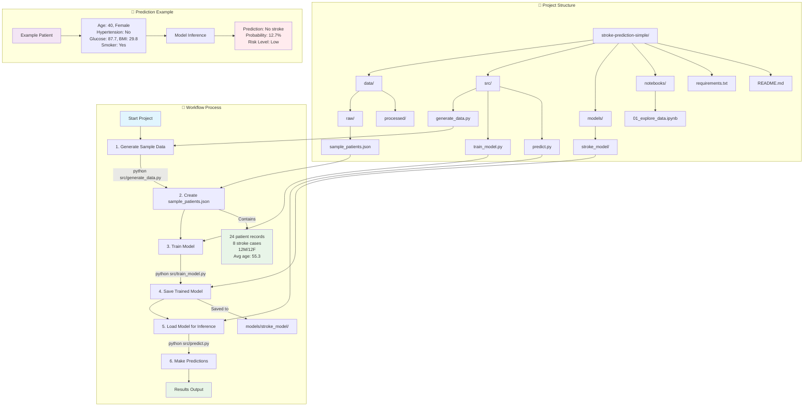

# Simple Stroke Prediction with PySpark

A minimal PySpark project for stroke prediction with training and inference.

## Quick Start

**Setup Java for spark**
```bash
sudo apt install -y openjdk-17-jdk
```

**Setup environment**:
```bash
pip install -r requirements.txt
```

**Run the complete flow***
```bash
python src/generate_data.py    # Create sample data
python src/train_model.py      # Train the model
python src/predict.py          # Make predictions
```

**Project Structure**



**Sample output running test_project.py:**
```text
============================================================
Testing Complete Stroke Prediction Project
============================================================

1. Generating sample data...
Generated 100 patient records
Stroke cases: 28

2. Training model...
Setting default log level to "WARN".
To adjust logging level use sc.setLogLevel(newLevel). For SparkR, use setLogLevel(newLevel).
25/12/11 12:16:30 WARN NativeCodeLoader: Unable to load native-hadoop library for your platform... using builtin-java classes where applicable
Total records: 100                                                              
Stroke cases: 28

Sample data:
+---+-----------------+----+------+-------------+------------+--------------------+----------+---------------+------+
|age|avg_glucose_level| bmi|gender|heart_disease|hypertension|        last_checkup|patient_id| smoking_status|stroke|
+---+-----------------+----+------+-------------+------------+--------------------+----------+---------------+------+
| 35|            190.2|24.1|Female|            0|           0|2024-12-12T12:16:...|    P10000|         smokes|     0|
| 73|             80.3|25.9|  Male|            0|           0|2024-12-20T12:16:...|    P10001|        Unknown|     0|
| 59|             93.4|25.2|  Male|            0|           1|2025-06-25T12:16:...|    P10002|         smokes|     0|
| 43|            131.5|36.2|  Male|            0|           1|2025-07-17T12:16:...|    P10003|         smokes|     1|
| 76|            138.0|23.6|Female|            0|           0|2025-10-15T12:16:...|    P10004|formerly smoked|     1|
+---+-----------------+----+------+-------------+------------+--------------------+----------+---------------+------+
only showing top 5 rows


Training model...

Model Evaluation:
Test set size: 23
Correct predictions: 17
Accuracy: 73.91%

Model saved to '../models/stroke_model'

Feature Importance:
age: 0.2151
hypertension: 0.0098
heart_disease: 0.0605
avg_glucose_level: 0.2472
bmi: 0.2480
gender_enc: 0.0732
smoking_enc: 0.0759

3. Testing predictions...
Setting default log level to "WARN".
To adjust logging level use sc.setLogLevel(newLevel). For SparkR, use setLogLevel(newLevel).
25/12/11 12:16:50 WARN NativeCodeLoader: Unable to load native-hadoop library for your platform... using builtin-java classes where applicable
Model loaded successfully!                                                      
Making prediction for example patient:
{
  "patient_id": "P10001",
  "age": 40,
  "gender": "Female",
  "hypertension": 0,
  "heart_disease": 0,
  "avg_glucose_level": 87.7,
  "bmi": 29.8,
  "smoking_status": "smokes"
}

Prediction Result:
{
  "patient_id": "P10001",
  "stroke_prediction": 0,
  "stroke_probability": 0.235,
  "risk_level": "Low"
}

==================================================
Batch Prediction Example:

Patient 1:
{
  "patient_id": "P10002",
  "stroke_prediction": 0,
  "stroke_probability": 0.285,
  "risk_level": "Low"
}

Patient 2:
{
  "patient_id": "P10003",
  "stroke_prediction": 0,
  "stroke_probability": 0.093,
  "risk_level": "Low"
}

4. Verifying project structure...
✓ data/raw/sample_patients.json
✗ models/stroke_model/metadata (missing)
✓ requirements.txt

============================================================
Project test complete!
============================================================
```
